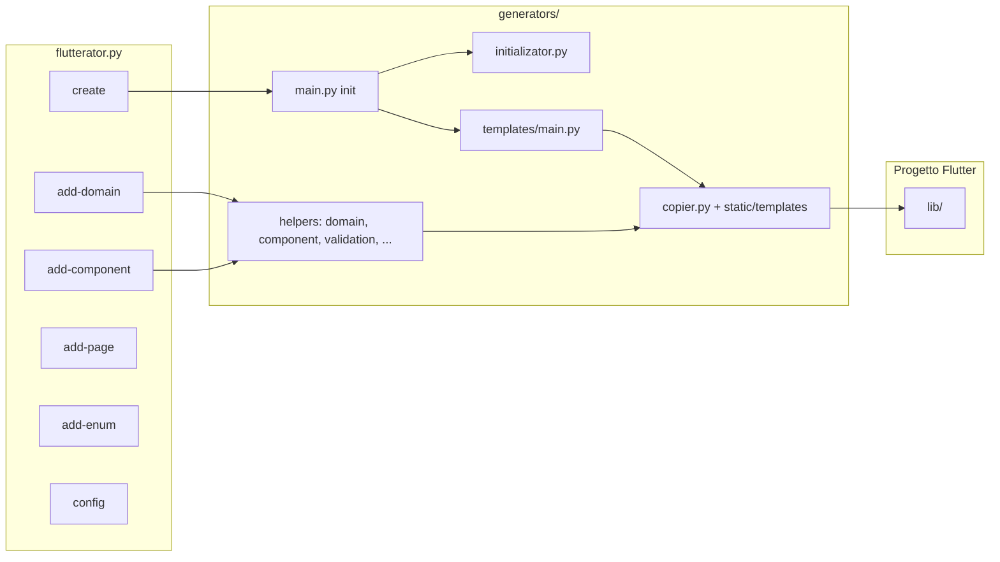
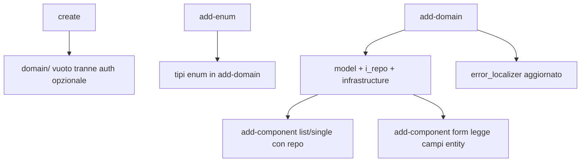

# Flutterator: struttura del tool, dei progetti generati e dei template

Documento di riferimento **dettagliato** su come Flutterator organizza il repository del generatore, la cartella `lib/` dei progetti Flutter creati o estesi, il flusso dei comandi CLI, i template Jinja e la configurazione.

---

## Indice

1. [Scopo e pubblico](#1-scopo-e-pubblico)
2. [Visione d’insieme](#2-visione-dinsieme)
3. [Repository Flutterator (il tool)](#3-repository-flutterator-il-tool)
4. [Meccanismo di generazione: `copier.generate_file`](#4-meccanismo-di-generazione-copiergenerate_file)
5. [Creazione progetto: `flutterator create`](#5-creazione-progetto-flutterator-create)
6. [Struttura `lib/` iniziale (cartelle)](#6-struttura-lib-iniziale-cartelle)
7. [Ordine di generazione dei file al `create`](#7-ordine-di-generazione-dei-file-al-create)
8. [Configurazione: `flutterator config` e YAML](#8-configurazione-flutterator-config-e-yaml)
9. [Dominio: `flutterator add-domain`](#9-dominio-flutterator-add-domain)
10. [Enum: `flutterator add-enum`](#10-enum-flutterator-add-enum)
11. [Pagine: `flutterator add-page`](#11-pagine-flutterator-add-page)
12. [Componenti: `flutterator add-component`](#12-componenti-flutterator-add-component)
13. [Altri comandi e utilità](#13-altri-comandi-e-utilità)
14. [Tipi di campo supportati (validazione)](#14-tipi-di-campo-supportati-validazione)
15. [Error localizer e failure di dominio](#15-error-localizer-e-failure-di-dominio)
16. [Dipendenze, asset e build](#16-dipendenze-asset-e-build)
17. [Convenzioni Dart e lint](#17-convenzioni-dart-e-lint)
18. [Dove intervenire per estendere Flutterator](#18-dove-intervenire-per-estendere-flutterator)
19. [Riferimento rapido template per area](#19-riferimento-rapido-template-per-area)

---

## 1. Scopo e pubblico

Questo documento serve a:

- **Chi usa la CLI**: capire dove finiscono i file, cosa aspettarsi da ogni comando e come si collegano dominio, feature e componenti.
- **Chi sviluppa Flutterator**: orientarsi tra `flutterator.py`, `generators/helpers/*`, `generators/templates/*` e `generators/static/templates/**/*.jinja`.

Non sostituisce il codice sorgente: in caso di divergenza, prevalgono i file Python e i template nel repository.

---

## 2. Visione d’insieme

Flutterator è una **CLI Click** (`flutterator.py`) che opera su (o crea) un progetto Flutter standard (`pubspec.yaml`, cartella `lib/`).



- **`create`**: crea directory progetto → `flutter create` → struttura cartelle → molti file da template → pubspec/analysis → asset.
- **`add-domain` / `add-component` / …`**: validano input, calcolano path e **dict di variabili**, poi chiamano `generate_file` ripetutamente (o scrivono stringhe Dart complesse nei helper).

---

## 3. Repository Flutterator (il tool)

### 3.1 Directory principali

| Path | Contenuto |
|------|-----------|
| `flutterator.py` | Gruppo Click: comandi utente, prompt, dry-run, integrazione con `generators.helpers`. |
| `generators/main.py` | `init(flutter_name, login)`: unico ingresso “crea progetto” dopo `flutter create`. |
| `generators/initializator.py` | Pulizia file default Flutter in `lib/`, creazione **albero cartelle** vuote. |
| `generators/__init__.py` | Re-export `init` da `generators.main`. |
| `generators/templates/main.py` | Orchestrazione **`generate_files`** post-create: lib, core, splash, home, logging, storage, apis, auth condizionale, **rigenerazione** `error_localizer` finale. |
| `generators/templates/copier.py` | `TEMPLATE_DIR = .../static/templates`, `generate_file(...)`. |
| `generators/static/templates/` | **Template Jinja** (~84 file `.jinja`) — unica fonte testuale dei Dart generati da template. |
| `generators/helpers/` | Logica: `domain.py`, `component.py`, `feature.py`, `validation.py`, `utils.py`, `config.py`, `navigation.py`, `project.py`, `page.py`, … |
| `generators/templates/_core/core_generator.py` | Core “di base”: app widget, entity/errors/failures/vo, infrastructure mixin, **widget comuni**, **error_localizer** (anche da `add-domain`). |
| `generators/templates/lib/lib_generator.py` | `main.dart`, `injection.dart`, `router.dart`. |
| `generators/templates/auth/`, `splash/`, `home/`, `apis/`, `logging/`, `storage/` | Moduli verticali: ognuno espone `generate_files` o funzioni simili. |
| `generators/config/` | `pubspec.py`, `analisy_options.yaml` (modello analysis per il progetto). |
| `generators/assets/` | Asset da copiare nel progetto creato. |
| `tests/` | Test pytest (`test_basic.py`, `test_integration.py`, …). |

### 3.2 Nomi e convenzioni nel tool

- **Nome progetto Flutter** (`project_name`): letto da `pubspec.yaml` (`name:`) o nome cartella — usato negli import `package:<project_name>/...`.
- **Path di output** relativo a `lib/`: il secondo argomento di `generate_file` è `lib_path: Path`; il file viene `lib_path / output_path`.

---

## 4. Meccanismo di generazione: `copier.generate_file`

Firma concettuale (vedi `generators/templates/copier.py`):

```text
generate_file(project_name, lib_path, template_name, output_path, args=None)
```

- **`template_name`**: path relativo a `generators/static/templates/`, es. `component/component_list_widget_template.jinja`.
- **`output_path`**: path relativo a `lib/`, es. `features/home/note_list/presentation/note_list_component.dart`.
- **`args`**: dizionario chiavi → valori sostituiti nel template come `[[chiave]]`. Sono sempre fusi con `project_name` e alcune chiavi speciali (`err_response_statusMessage`, …).

### Delimitatori Jinja

I template usano **`variable_start_string='[['`** e **`variable_end_string=']]'`** per evitare conflitti con:

- stringhe Dart `"$variable"`;
- interpolazioni `${...}` in alcuni contesti.

Le direttive Jinja standard restano `` (if/for/include).

### Creazione directory

`output_file.parent.mkdir(parents=True, exist_ok=True)` — le cartelle intermedie vengono create se mancanti.

---

## 5. Creazione progetto: `flutterator create`

### 5.1 Sequenza (`generators/main.py` → `init`)

1. Verifica che la cartella progetto non esista (o conferma sovrascrittura).
2. **`flutter create <name> --org com.example --project-name <name> --template app`**
3. **`initialize_project(lib_path, project_path, login)`** (`initializator.py`):
   - elimina `lib/main.dart` di default;
   - opzionalmente ripulisce `test/widget_test.dart`;
   - crea l’albero cartelle (sezione 6).
4. **`load_config(project_path)`** — legge `flutterator.yaml`, `~/.flutteratorrc`, default.
5. **`generate_files(lib_path, login, project_name, primary_color, secondary_color)`** — `generators/templates/main.py` (sezione 7).
6. **`generate_config_files`** — pubspec, analysis_options.
7. **`copy_assets`** — asset nella cartella progetto.

### 5.2 Opzione `--login`

Se attiva:

- in fase di **cartelle**, si aggiungono path sotto `domain/auth` e `features/auth` (vedi `initializator.py`);
- in fase di **template**, vengono generati login, sign-in form, user profile collegato, ecc. (`templates/main.py` chiama `generate_auth_files`, `generate_sign_in_form_files`, …);
- **`generate_apis_files(..., has_login=True)`** allinea l’interceptor (es. refresh token / sign-out) al contesto con login;
- **`generate_error_localizer`** riceve `has_login=True` e può includere `localizeAuthFailure` oltre alle failure di dominio scansionate.

---

## 6. Struttura `lib/` iniziale (cartelle)

Elenco da `generators/initializator.py` → `create_folder_structure` (sempre creato):

```text
apis/clients
apis/common
apis/core
apis/interceptors
core
core/infrastructure
core/presentation
core/model
domain
features
features/home
features/splash
logging
storage
widgets/common
```

Se **`login`** è vero, si aggiungono anche:

```text
domain/auth
domain/auth/infrastructure
domain/auth/model
features/auth
features/auth/application
features/auth/presentation
features/auth/sign_in_form
features/auth/sign_in_form/application
features/auth/sign_in_form/presentation
```

**Nota:** le entità aggiunte con `add-domain` vivono sotto `lib/<domain_folder>/<entity_folder>/` (default `lib/domain/<nome>/`), non necessariamente sotto `features/`.

---

## 7. Ordine di generazione dei file al `create`

Ordine definito in **`generators/templates/main.py`** → `generate_files` (dopo cartelle e config load):

| # | Chiamata | Ruolo |
|---|----------|--------|
| 1 | `generate_lib_files` | `main.dart`, `injection.dart`, `router.dart` (`lib_generator.py`) |
| 2 | `generate_core_files` | App widget, modello core (entity, errors, failures, value objects, validators), infrastructure base, **widget comuni**, **prima** passata `error_localizer` |
| 3 | `generate_splash_files` | Splash |
| 4 | `generate_logging_files` | Logger / console / analytics |
| 5 | `generate_storage_files` | Repository preferenze / token |
| 6 | `generate_apis_files` | Costanti, logger API, interceptor, modulo API (`has_login`) |
| 7 | `generate_home_files` | Home |
| 8 | *(se login)* `generate_auth_files` | Domain auth + feature auth |
| 9 | *(se login)* `generate_sign_in_form_files` | Form di sign-in |
| 10 | **`generate_error_localizer`** (finale) | Riscansiona **tutti** i `*_failure.dart` sotto `domain/` (inclusi user_profile creati con auth) e rigenera `core/errors/error_localizer.dart` |

Il **`core_generator`** usato al punto 2 include tra l’altro:

- `core/presentation/app_widget.dart`
- `core/model/*` (interfaces, entity, errors, failures, value_objects, value_validators)
- `core/infrastructure/*` (base_mapper, repository_error_handler, base_repository_mixin)
- `widgets/common/*` (loading, error, unknown state)

---

## 8. Configurazione: `flutterator config` e YAML

### 8.1 File e priorità

Definito in `generators/helpers/config.py`:

1. **Default** interni (`DEFAULTS` nel dataclass).
2. **`~/.flutteratorrc`** (YAML globale).
3. **`flutterator.yaml`** nella root del progetto Flutter (`PROJECT_CONFIG_FILE`).
4. **Override da CLI** (gestiti dal comando che invoca `apply_cli_overrides`, es. `--folder`, `--no-build`).

### 8.2 Chiavi supportate (estratto)

| Chiave / sezione | Effetto |
|------------------|---------|
| `defaults.feature_folder` | Cartella radice feature (es. `features`) per `add-page` e path di default. |
| `defaults.domain_folder` | Radice dominio (es. `domain`) per `add-domain`, `add-enum`, scansione modelli. |
| `defaults.component_folder` | Default cartella componenti (es. `features/components`) se non si usa prompt interattivo. |
| `defaults.auto_run_build_runner` | Se `true`, dopo operazioni rilevanti si esegue `flutter pub get` / build_runner (vedi `run_flutter_commands` in `flutterator.py`). |
| `styling.primary_color` / `secondary_color` | Esadecimali passati a `main_template.jinja` come `Color(0xFF...)`. |
| `templates` | Mappa opzionale per template custom (estensibilità futura / override). |
| `dependencies` | Lista pacchetti extra da aggiungere al pubspec (logica in config). |

### 8.3 Esempio minimale `flutterator.yaml`

```yaml
defaults:
  feature_folder: features
  domain_folder: domain
  component_folder: features/home
  auto_run_build_runner: true
styling:
  primary_color: "#1976D2"
  secondary_color: "#FF6F00"
```

---

## 9. Dominio: `flutterator add-domain`

### 9.1 Cosa fa la CLI (`flutterator.py`)

- Opzioni: `--name`, `--fields`, `--folder`, `--project-path`, `--dry-run`, `--no-build`.
- Normalizza il nome:
  - se **PascalCase senza underscore** (es. `NoteItem`) → cartella snake `note_item`, classe `NoteItem`;
  - altrimenti → cartella snake normalizzata, classe `to_pascal_case_preserve`.
- **`--folder`**: prefisso sotto `lib/` (default da config, tipicamente `domain`). Esempio `--folder shared/domain` → file sotto `lib/shared/domain/<entity>/`.
- **`--fields`**: stringa `nome:tipo,nome2:tipo2` parsata da `parse_fields_string` (errori di formato → messaggio chiaro).
- Ogni campo: `validate_field_name` + **`validate_field_type(..., lib_path, folder)`** dove `folder` è il **domain root** logico (es. `domain` o `shared/domain`) per trovare enum e modelli esistenti.
- Se non c’è campo `id`, viene inserito **`id: string`** (poi normalizzato nel flusso dominio).

### 9.2 Output su disco

Per entità `note` in `lib/domain/note/`:

| Percorso | File |
|----------|------|
| `model/` | `<entity>.dart`, `<entity>_failure.dart`, `i_<entity>_repository.dart`, `value_objects.dart`, `value_validators.dart` (se generati dal flusso) |
| `infrastructure/` | `<entity>_dto.dart`, `<entity>_service.dart`, `<entity>_mapper.dart`, `<entity>_repository.dart` |

Logica principale: **`generators/helpers/domain.py`** → `create_domain_entity_layers`.  
Template: `generators/static/templates/domain/*.jinja` e vari `feature/*_template.jinja` riusati per entity/dto/repository ecc.

### 9.3 Dopo la generazione

- Viene chiamato **`generate_error_localizer`** con `domain_folder=<folder>` e `has_login=infer_has_login(lib_path)` così i nuovi `*Failure` compaiono nel localizer senza perdere il ramo auth se esiste già la UI login.

---

## 10. Enum: `flutterator add-enum`

- Crea un file enum sotto **`lib/<domain_folder>/enums/`** (cartella creata se assente).
- Template: `domain/enum_template.jinja`.
- Gli enum definiti lì diventano tipi ammissibili in **`add-domain`** (validazione enum + import nei mapper/entity).

---

## 11. Pagine: `flutterator add-page`

- Aggiunge una pagina sotto **`lib/<feature_folder>/<name>/`** (feature folder da config, default `features`).
- Aggiorna **`lib/router.dart`** (GoRouter).
- Pensata per pagine **semplici** senza BLoC dedicato generato dal tool; per UI con stato/repository si consiglia **`add-component`**.

---

## 12. Componenti: `flutterator add-component`

### 12.1 Opzioni e vincoli

| Opzione | Note |
|---------|------|
| `--name` | Nome componente (snake_case internamente). |
| `--type` | `form` \| `list` \| `single` (case insensitive). |
| `--fields` | **Solo con `--type form`**: elenco campi; altrimenti errore. |
| `--folder` | Es. `features/home` — path sotto `lib/`. Se omesso, in modalità interattiva si sceglie tra le directory in `lib/features/`. |
| `--project-path` | Root progetto Flutter. |
| `--dry-run` | Anteprima senza scrivere file. |
| `--no-build` | Salta `flutter pub get` / build_runner anche se la config richiede build automatica. |

### 12.2 Scelta del modello di dominio

Dopo il tipo, la CLI elenca i modelli trovati con **`find_domain_models_with_class_names(lib_path, domain_folder)`**:

- **`0` (Vuoto)**: componente senza repository — stati minimali / stub (vedi rami “empty” in `component.py`).
- **`1..N`**: nome stem del modello e cartella (`domain_model_name`, `domain_model_folder`) passati ai generator.

Per **`form`** con modello:

- Si legge la struttura campi con **`get_model_fields_from_domain`**;
- opzionalmente si filtrano i campi con **`prompt_select_form_model_fields`** (escludere `id` o campi non desiderati nel form).

### 12.3 Directory di output

```text
lib/<folder>/<component_name>/
  application/   … BLoC, event, state (o *FormBloc / *FormEvent / *FormState)
  presentation/  … <component_name>_component.dart
```

La cartella `application` / `presentation` viene creata implicitamente dai generator che scrivono i file.

### 12.4 Tre implementazioni principali (`component.py`)

| Tipo | Funzione | BLoC | UI template |
|------|----------|------|---------------|
| **single** | `create_component_layers` | `*_bloc.dart` + part Freezed | `component_widget_template.jinja` |
| **list** | `create_component_list_layers` / `_empty` | stesso pattern, handler CRUD da **`get_repository_info`** | `component_list_widget_template.jinja` |
| **form** | `create_component_form_layers` | `BaseFormBloc`, event/state form | `component_form_*` |

#### `get_repository_info` (list / single con dominio)

Legge **`lib/<domain>/<model_folder>/model/i_<model>_repository.dart`** e ricava:

- nome classe **failure** (`Either<MyFailure, …>`);
- import package della failure;
- **insieme dei metodi** (`getAll`, `getById`, `create`, `update`, `delete`, `getCurrentUserProfile`, …) per generare solo gli handler e gli eventi supportati.

Se il file non esiste, si usano convenzioni di fallback (es. `{Model}Failure`, set di metodi di default).

#### List: reload e stati

Il BLoC lista supporta **`Loaded(items, isReloading)`** e **`reloadRequested`**: durante il reload i dati precedenti restano visibili con indicatore di caricamento (logica nei template/helper già allineati a questo pattern).

#### Import nel widget lista

L’import del BLoC nel template lista è **`package:<project>/<component_import_prefix>/application/<component>_bloc.dart`** (non path relativi), per rispettare `always_use_package_imports`.

### 12.5 Widget comuni

`ensure_common_widgets` (da `core_generator`) viene invocato quando si aggiunge un component che usa loading/error — su progetti vecchi senza `widgets/common` vengono creati i file mancanti.

---

## 13. Altri comandi e utilità

| Comando | Stato / ruolo |
|---------|----------------|
| `flutterator list` | Elenca route da `router.dart` e modelli sotto `domain/` (parsing e directory walk in `flutterator.py`). |
| `add-drawer-item` / `add-bottom-nav-item` | **Non esposti nella CLI**: il decoratore `@cli.command()` è commentato; restano le funzioni Python (e docstring) per riferimento o riattivazione manuale. Usa `add-page` o `add-component` per navigazione nuova. |
| `add-feature` | **Non è un comando Click**: la funzione esiste ma senza `@cli.command()`; se invocata direttamente stampa errore e `sys.exit(1)` con istruzioni verso `add-domain` / `add-component`. |

Versione CLI: costante **`VERSION`** in `flutterator.py` (attualmente `3.1.1`, esposta con `@click.version_option`).

---

## 14. Tipi di campo supportati (validazione)

Implementazione: **`generators/helpers/validation.py`**.

- **`parse_field_type`**: regex per `Map<K,V>`, `List<T>`, tipo semplice.
- **`validate_field_type`**: nullable con suffisso `?`, normalizzazione primitive (`string` → `String`, `date`/`datetime` → `DateTime`, …).
- **Generici Map**: chiave e valore risolti con `_resolve_generic_type`:
  - primitive (`VALID_PRIMITIVE_TYPES`);
  - **`dynamic`** / **`Object`** (accettati esplicitamente per JSON-like);
  - `UniqueId` (`KNOWN_VALUE_OBJECT_TYPES`);
  - enum noti sotto `domain/.../enums`;
  - modelli dominio (PascalCase / stem noto in `find_domain_models_with_class_names`).
- **Liste / set**: un solo parametro generico, stessa logica di risoluzione.
- Tipi **sconosciuti**: messaggio con suggerimenti (typo su `String`, ecc.).

---

## 15. Error localizer e failure di dominio

- File generato: **`lib/core/errors/error_localizer.dart`**.
- **`generate_error_localizer`** (`core_generator.py`):
  - scansiona i modelli sotto `lib/<domain_folder>/` tramite `find_domain_models_with_class_names`;
  - per ciascuno, se esiste `<stem>_failure.dart`, aggiunge un metodo `localize<Class>Failure` nel template;
  - **Auth**: se esiste `domain/auth/model/auth_failure.dart` oppure `has_login`, si include il ramo per `localizeAuthFailure` ed evita duplicati generici sullo stem `auth`.

Dopo ogni **`add-domain`** il localizer viene **rigenerato** per includere la nuova failure.

---

## 16. Dipendenze, asset e build

### 16.1 Pubspec

- **`generators/config/pubspec.py`**: elenco dipendenze principali e dev; esecuzione `flutter pub add` nel progetto.
- Include stack tipico: `flutter_bloc`, `bloc`, `freezed`, `dartz`, `get_it`, `injectable`, `dio`, `retrofit`, `go_router`, `caravaggio_ui`, **`provider`** (per tipizzazione `MultiBlocProvider`), ecc.

### 16.2 Analysis

- Modello in `generators/config/analisy_options.yaml` copiato/adattato nel progetto (regole tipo `always_specify_types`, `always_use_package_imports`, …).

### 16.3 Asset

- **`generators/assets/`**: copiati nel progetto creato (`copy_assets`).

### 16.4 Code generation Flutter

Il progetto generato usa **Freezed**, **json_serializable**, **retrofit_generator**, **injectable_generator**: dopo `create` / `add-domain` / `add-component`, se `auto_run_build_runner` è vero e non passi `--no-build`, viene lanciata la routine in **`run_flutter_commands`** (`build_runner`, ecc. — vedi implementazione in `flutterator.py`).

---

## 17. Convenzioni Dart e lint

I template sono stati allineati progressivamente a:

- **`always_specify_types`**: tipi espliciti in `fold`, `catch`, `BlocBuilder`, pattern `switch` su stati Freezed, ecc.
- **`always_use_package_imports`**: import `package:...` anche verso il BLoC dello stesso feature folder.
- **`MultiBlocProvider`**: lista `providers` tipizzata (`SingleChildWidget` + dipendenza `provider` esplicita nel pubspec).

---

## 18. Dove intervenire per estendere Flutterator

1. **Nuovo file Dart fisso** → aggiungi `.jinja` sotto `generators/static/templates/...` e una funzione che chiama `generate_file` con il dizionario variabili corretto.
2. **Nuova regola di dominio / tipo campo** → `validation.py` + eventualmente `domain.py` (mapper/repository) + `utils.py` (`map_field_type_to_dto`, `_dto_for_single_type`).
3. **Nuovo tipo di componente** → `flutterator.py` (prompt / opzioni) + `component.py` (nuova funzione `create_component_*`) + template dedicati.
4. **Nuovo comando CLI** → `@cli.command()` in `flutterator.py` + helper dedicato + test in `tests/`.

---

## 19. Riferimento rapido template per area

Percorso radice: **`generators/static/templates/`**.

| Sottocartella | Contenuto tipico |
|---------------|------------------|
| *(root)* | `main_template.jinja`, `injection_template.jinja`, `router_template.jinja`, `page_template.jinja` |
| `apis/` | costanti, `api_injectable_module`, interceptor auth, `api_logger` |
| `auth/` | failure, facade, bloc, login page, value objects utente, … |
| `auth/sign_in_form/` | bloc/event/state/template UI form, google/apple |
| `core/bloc/` | `base_form_bloc` |
| `core/errors/` | `error_localizer` |
| `core/infrastructure/` | base mapper, mixin repository, error handler repository |
| `core/model/` | entity core, errors, failures, value objects, validators, interfaces |
| `core/presentation/` | `app_widget`, drawer, bottom nav |
| `domain/` | mapper/repository/service **template** per entità create con `add-domain` |
| `feature/` | entity/dto/event/state/bloc/page/repository retrofit **stile feature full-stack** (usati anche in flussi domain) |
| `component/` | widget list/single/form, bloc form, event/state form |
| `home/`, `splash/` | schermate shell |
| `logging/` | logger, console, analytics |
| `storage/` | storage repository |
| `user_profile/` | modello + infrastruttura profilo (flusso login) |
| `widgets/common/` | loading, error, unknown state |

Per l’elenco aggiornato al tuo clone: `find generators/static/templates -name '*.jinja' | wc -l` o esplora l’IDE.

---

## Appendice A — Diagramma cartelle progetto dopo diversi comandi

```text
lib/
  main.dart
  injection.dart
  router.dart
  apis/ ...
  core/ ...
  domain/
    <aggregate>/
      model/
      infrastructure/
    enums/          # add-enum
    auth/ ...       # se create --login
    user_profile/ ... # se create --login
  features/
    home/ ...
    splash/ ...
    auth/ ...       # se login
    <feature>/<component>/   # add-component
      application/
      presentation/
  logging/
  storage/
  widgets/common/
```

---

## Appendice B — Dipendenze logiche tra comandi



---

*Documento generato come guida operativa al repository Flutterator. Aggiornalo quando cambiano comandi CLI, ordine di `generate_files` o convenzioni di path.*
